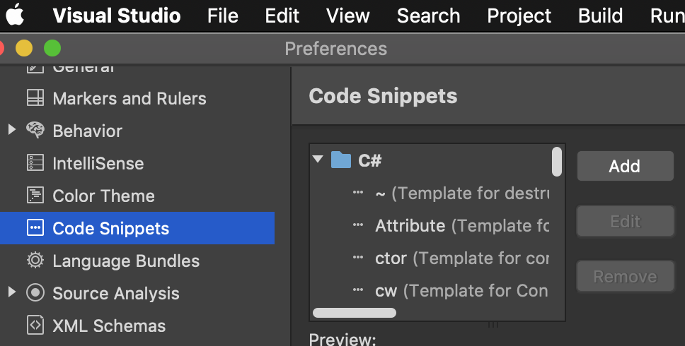
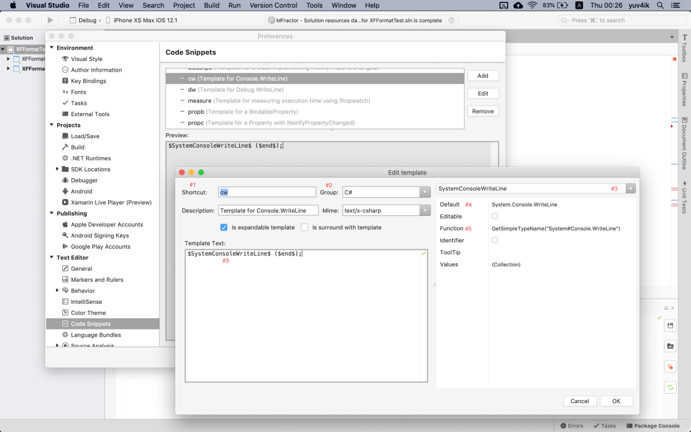

# Backup, Restore Visual Studio Mac snippets

## Predefined custom snippets

There are some predefined snippet locating at [snippets/csharp](snippets/csharp) which you can make use.
You can see snippet details [__HERE__](snippets/csharp/snippet-details.md).

## Create Snippets

Visual Studio for Mac is shipped with a [default code snippets](https://docs.microsoft.com/en-us/visualstudio/ide/visual-csharp-code-snippets?view=vs-2015) that can be used as a great example. The following steps is to create custom snippet.

- Open the editor by clicking on `Visual Studio` > `Preferences` > `Text Editor` > `Code Snippets`



- Click `Add` button on the right

- Fill out your snippets



Name|Detail
-|-
__Shortcut__|The shortcut we have to type in order to generate the code from the template. In this example it is cw (Console.WriteLine).
__Group__|there are different available groups including F#, Python and Razor.
__Variables__|on the screenshot #3 appear twice to demonstrate the definition of the $SystemConsoleWriteLine$ variable and its properties.
__Default__|stands for the default value of the variable. Please note that in order to avoid confusion we should also provide a namespace.
__Function__|we can apply built-in functions like GetSimpleTypeName("System#Console.WriteLine"). It will make sure to remove the namespace before Console.WriteLine if using System is already in place otherwise it will use the default value (#4). The list of supported functions can be found [here](https://github.com/mono/monodevelop/blob/master/main/src/core/MonoDevelop.Ide/MonoDevelop.Ide.CodeTemplates/ExpansionObject.cs#L268).


## Location

- The template is just a XML file that live in `~/Library/VisualStudio⁩/{version}/Snippets/{shortcut}.template.xml` directory, which means that you can easily import and export code snippets that you create.

> _Library_ folder may be hidden.  
> Use `Command + Shift + .` to toggle show/hide files

## Structure

```xml
<?xml version="1.0" encoding="utf-8"?>
<CodeTemplates version="3.0">
  <CodeTemplate version="2.0">
    <Header>
      <_Group>C#</_Group>
      <Version />
      <MimeType>text/x-csharp</MimeType>
      <Shortcut>cmt</Shortcut>
      <_Description>Block of comment</_Description>
      <TemplateType>Expansion</TemplateType>
    </Header>
    <Variables />
    <Code><![CDATA[/* ==================================================================================================
 * $end$
 * ================================================================================================*/]]></Code>
  </CodeTemplate>
</CodeTemplates>
```

## Usage

- Copy `xml` files into `~/Library/VisualStudio⁩/{version}/Snippets/{shortcut}.template.xml` directory
- Close and re-open Visual Studio Mac
- Type shortcut (example: `cmt`)
- Press `Tab`, `Tab` (tab 2 times)

## Contribution

You are more than welcome to contribute your favorite code snippets.
Please follow these steps:

- Create a snippet using VS for Mac or copy an existing one from `~/Library/VisualStudio⁩/{version}/Snippets` to `snippets/csharp` directory.
- Update [Backup, Restore Visual Studio Mac snippets.md](backup-restore-visual-studio-mac-snippets.md).
- Create a Pull Request.
